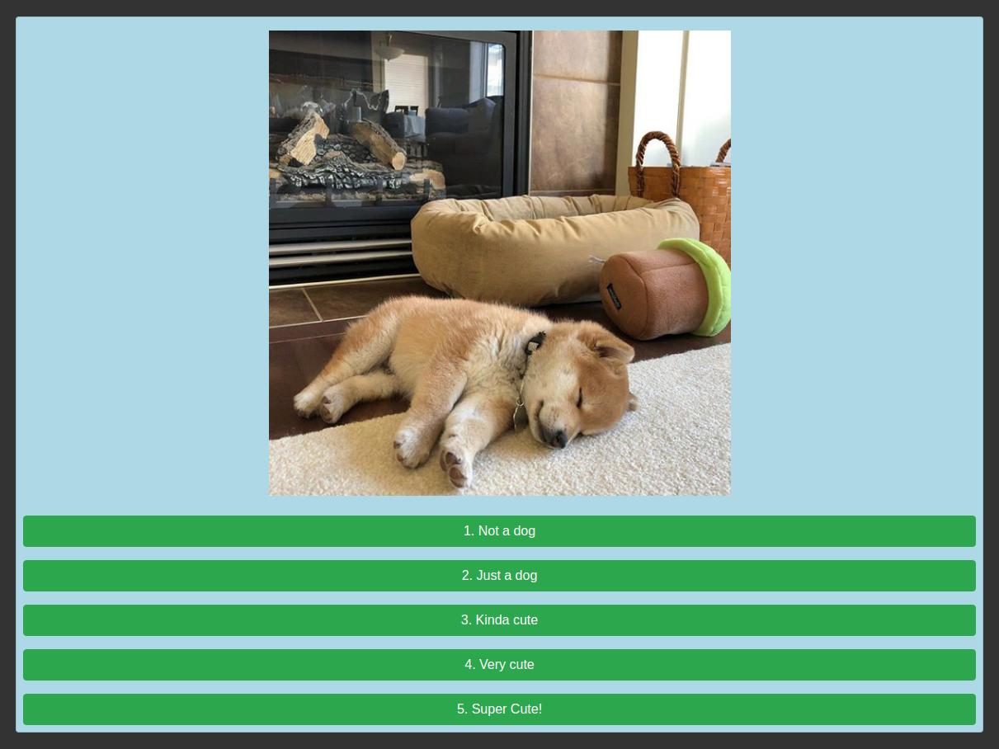

# Image labeling

This project provides webpage that shows images of dogs to which the user can assign a label. The labeled images are placed inside an S3 bucket. The whole project was built using the AWS serverless architecture.

### What does it do?
This is a tool to scrape and categorize images. Every 24 hours the highest rated images of cute animails on [Reddit](reddit.com) are selected for labeling. The user can go to a webpage where he is presented the images and is asked to label it accordingly.

The labeled images are collected in an S3 bucket.

### How does it work?
First we need to get a set of images that need to be labeled. This is done with the ScraperLambda which is able to download images from reddit using [praw](https://praw.readthedocs.io/en/latest/). This is a Lambda function that is called every 24h by a scheduled Cloudwatch event to go through the highest ranked posts of certain subreddits with images of cute animals.

The frontend is a static website, hosted from an S3 bucket.

Once the images have been uploaded to the source bucket, we can start the labeling process. The frontend makes a call to an ApiGateway endpoint which executes a Lambda function that connects to an S3 bucket where the unlabeled images are stored to get a list of images that need to be shown to the user. When the user clicks a label, again a Lambda is called through ApiGateway to move the image from the source bucket to the bucket with labeled images.

All resources are provisioned through AWS Cloudformation.

### Running the project

This project can be deployed on AWS with some small adjustments:
(No need to do this if you don't want to use the scraper lambda)
Create credentials for the scraper lambda on [reddit](https://github.com/reddit-archive/reddit/wiki/oauth2) and update cloudformation/reddit_creds.json

##### deploying to AWS

Run the `packages-lambdas.sh` script to create deployment packages for the lambdas.

`cd` into cloudformation/ and run the `deploy-cloudformation.py` script. This deployed the application to AWS.

Run `deploy-html.py` to deploy the frontend to the frontend bucket.

That should be it! Check the S3 bucket configuration in the aws console to get the url to the frontendbucket.

### AWS services used
* **Cloudformation**
        Used to deploy application
* **IAM**
       Used to define roles that allow access of Lambdas and ApiGateway to other resources.
* **ApiGateway**
        Contains RestAPI for communication between frontend and backend
* **Lambda**
        Two lambdas are used: one for managing the images in the source/target bucket and one to scrape images from reddit.
* **S3**
        Used for both storing the images and hosting the frontend